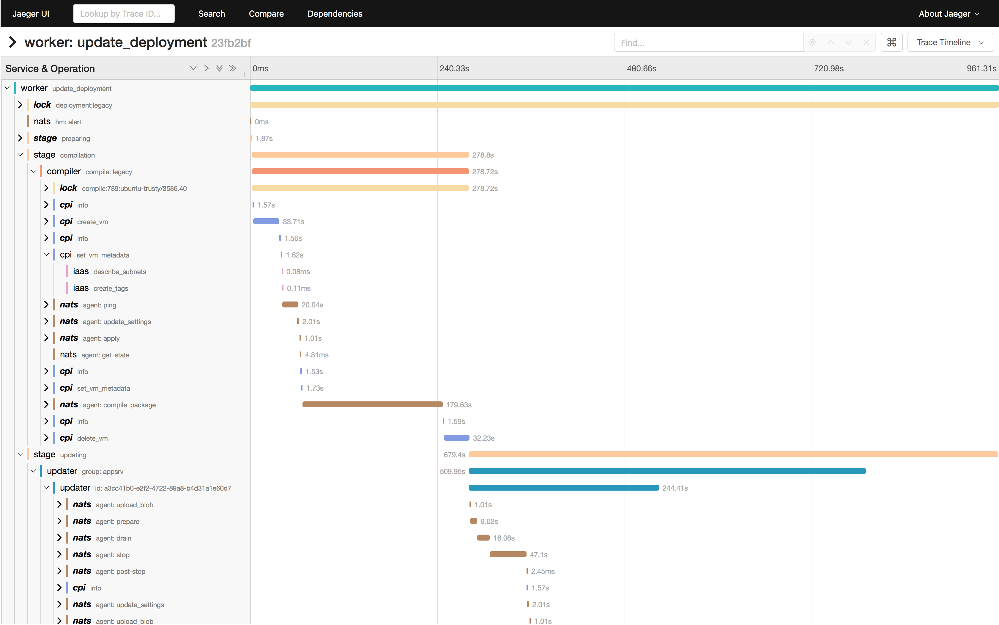

# bosh-log-tracer

To visualize what BOSH is busy doing during a task.

It's taking an after-the-fact approach at profiling by reading logs and pretending it knows what BOSH was thinking while it happened. You probably shouldn't fully trust the accuracy of the results.

## Quick Start

Run [Jaeger](https://www.jaegertracing.io/) (the tooling and UI) locally according to their [Getting started](https://www.jaegertracing.io/docs/1.12/getting-started/) guide...

    docker run -d --name jaeger \
      -e COLLECTOR_ZIPKIN_HTTP_PORT=9411 \
      -p 5775:5775/udp \
      -p 6831:6831/udp \
      -p 6832:6832/udp \
      -p 5778:5778 \
      -p 16686:16686 \
      -p 14268:14268 \
      -p 9411:9411 \
      jaegertracing/all-in-one:1.12

Provide the debug log of a deploy task via `STDIN`...

    bosh task --debug 1234 | go run github.com/dpb587/bosh-log-tracer/cmd/taskdebugjaeger

Open the URL it prints (something like http://localhost:16686/trace/1cfa67194cc4d8ef).

## Caveats

alpha/experiment/buggy/use-at-your-own-risk; also:

 * alpha (pre-alpha?)
 * experiment / proof of concept; worth pursuing more? get in touch
 * currently only works with deploy tasks
 * not tested with failed tasks
 * not tested across diverse environments
 * don't expect the code to easily make sense right now
 * relevant log lines are included in traces and may include sensitive data

## Screenshot

# License

[Apache License, Version 2.0](LICENSE)
